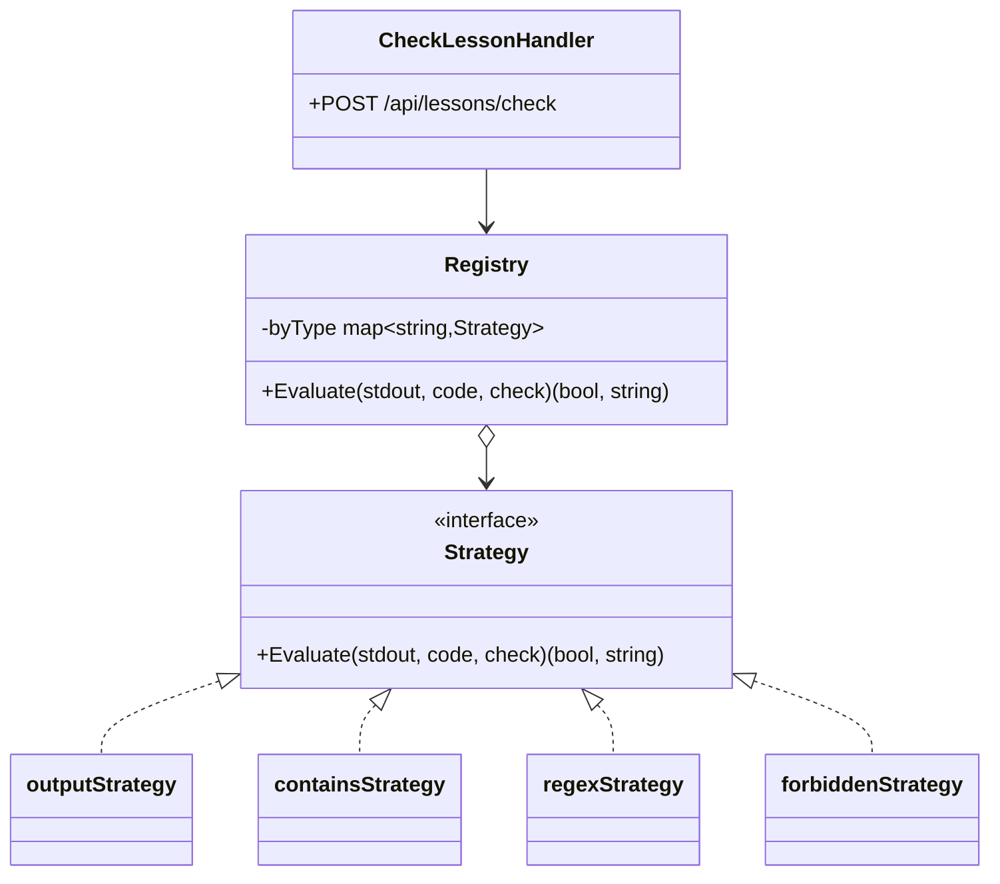
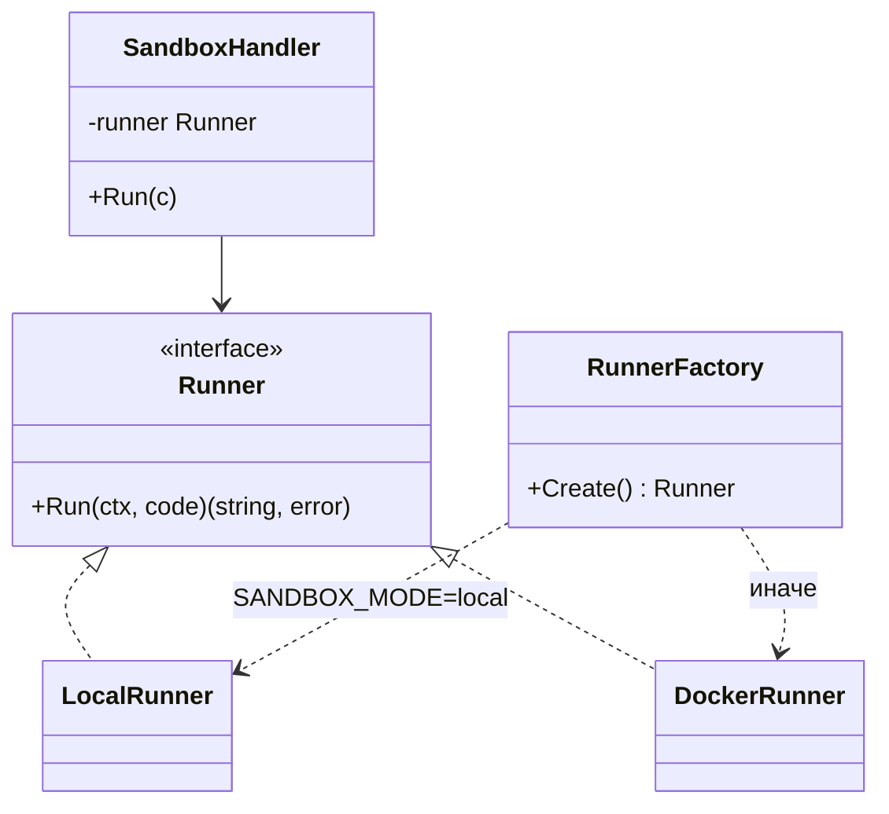
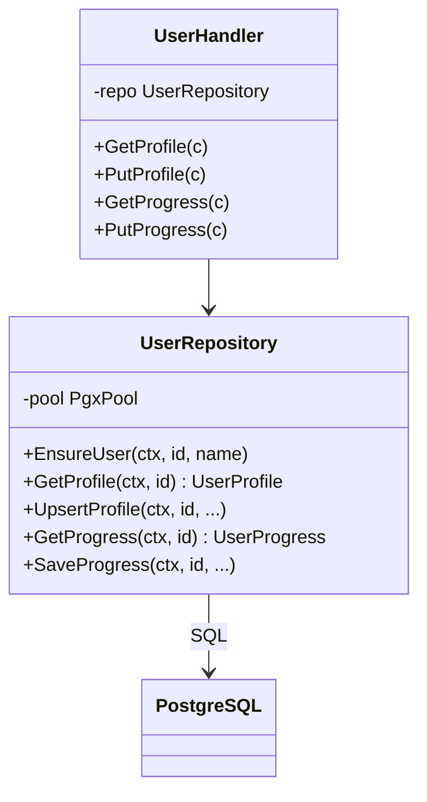
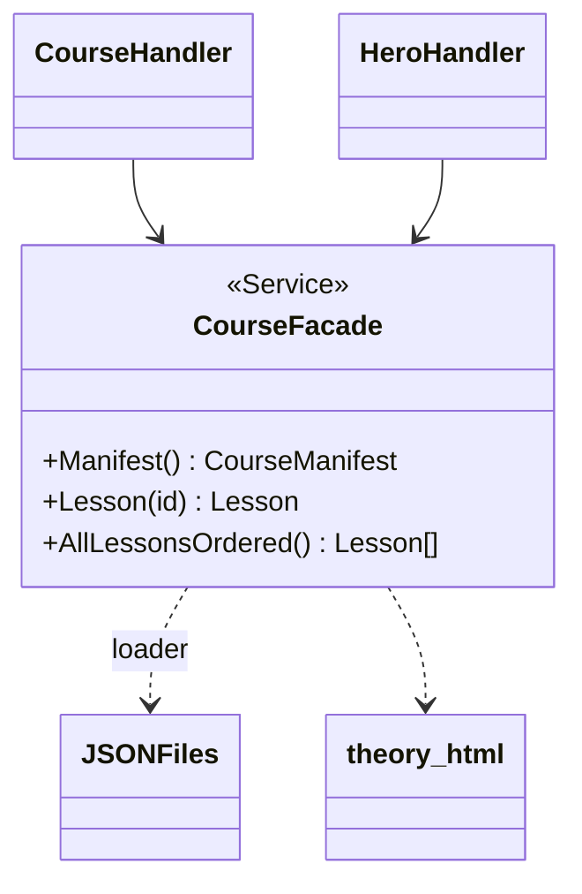

# 3. Паттерны проектирования и распределённый монолит

## 3.1 Распределённый монолит

| Слой | Технология | Назначение |
|------|------------|------------|
| Презентация | React 18, Vite, TypeScript | UI: курс, профиль, достижения |
| API | Go 1.22, Gin | REST JSON `/api/*` |
| Данные курса | JSON-файлы + PostgreSQL | Контент уроков / профиль и прогресс |
| Песочница | Docker / local `go run` | Безопасный запуск кода студента |

Связь: фронтенд проксирует `/api` на `localhost:8080` (Vite) или через Docker Compose.

## 3.2 Паттерн «Стратегия» — автопроверка заданий

**Назначение:** разные алгоритмы проверки (`output`, `contains`, `regex`, `forbidden`) без ветвления `switch` в обработчике HTTP.

**Реализация:** `backend/internal/checker/strategy.go`

## 3.3 Паттерн «Фабричный метод» — песочница Go

**Назначение:** создавать `Runner` (локальный или Docker) по переменной окружения `SANDBOX_MODE`.

**Реализация:** `backend/internal/sandbox/factory.go`

## 3.4 Паттерн «Репозиторий» — доступ к PostgreSQL

**Назначение:** изолировать SQL от HTTP-слоя; тестируемая абстракция хранения профиля и прогресса.

**Реализация:** `backend/internal/repository/user.go`

## 3.5 Паттерн «Фасад» — курс

**Назначение:** единый интерфейс `course.Service` для манифеста и уроков, скрывающий чтение JSON и HTML-оверлеев.

**Реализация:** `backend/internal/course/loader.go`

## 3.6 Тестирование бизнес-процессов

| Процесс | Проверка |
|---------|----------|
| Прохождение урока | Запуск кода → `POST /api/sandbox/run` → `POST /api/lessons/check` → отметка в localStorage + опционально БД |
| Расчёт уровня героя | `POST /api/hero-level/compute` (unit-тесты `hero_test.go`) |
| Профиль студента | Валидация имени/аватара → `PUT /api/users/:id/profile` |
| Чат-репетитор | `POST /api/chat/tutor` (при наличии `OPENAI_API_KEY`) |
